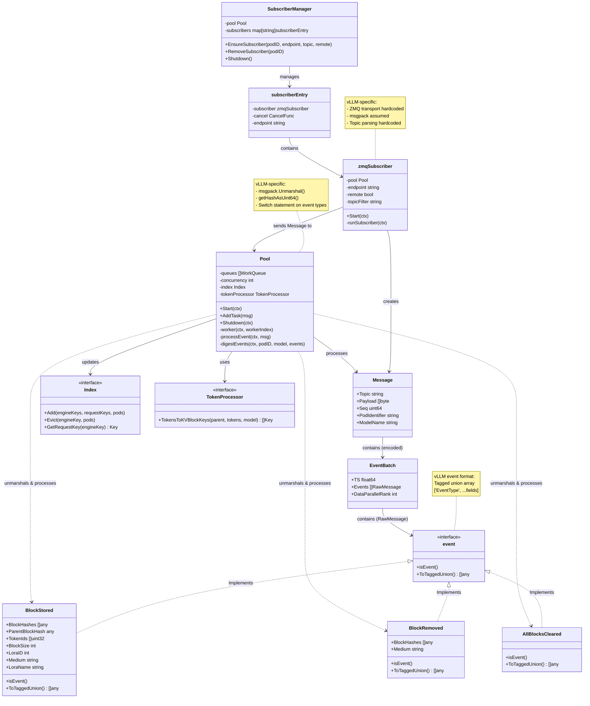
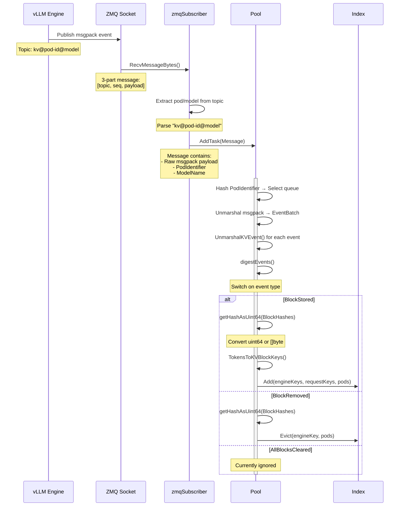
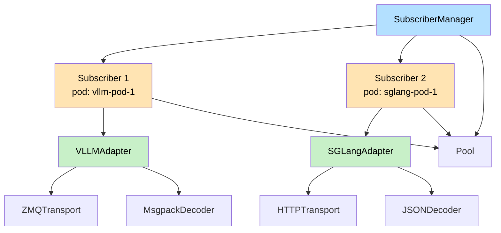
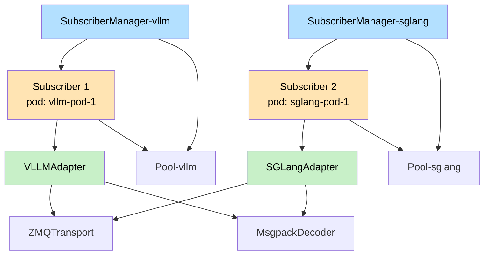
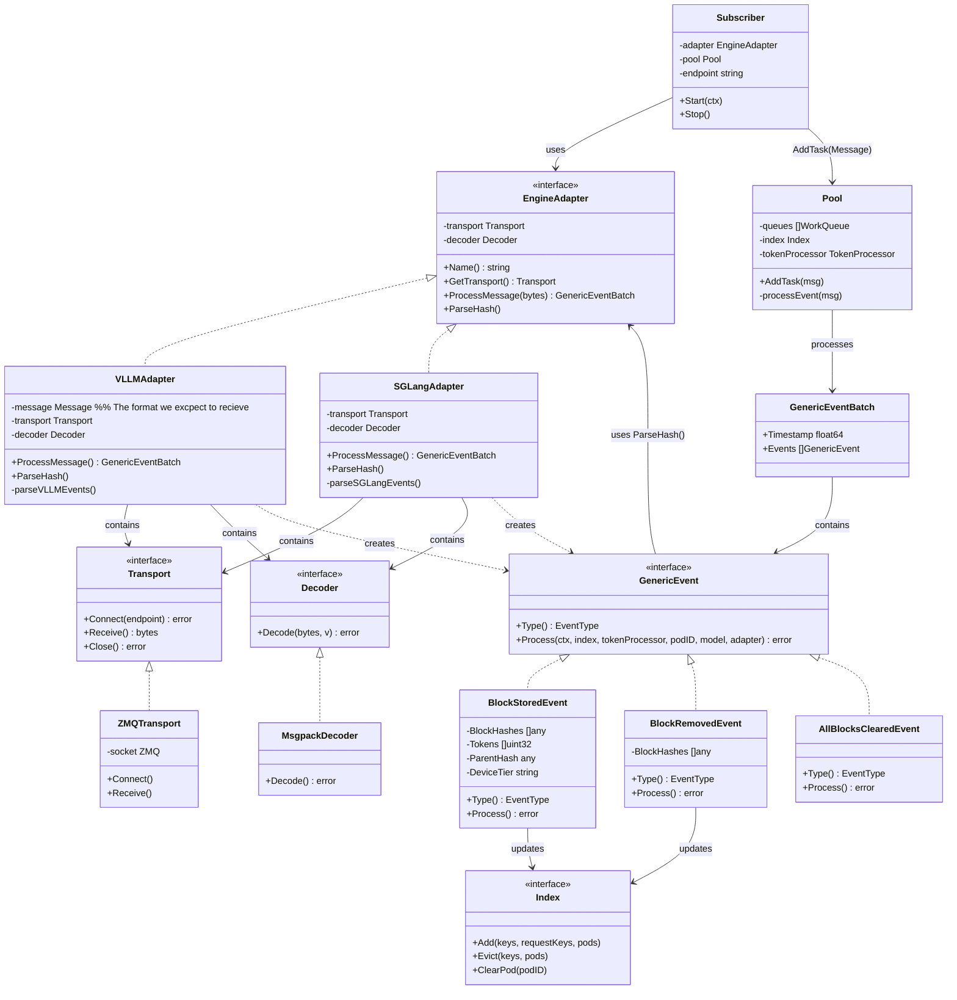
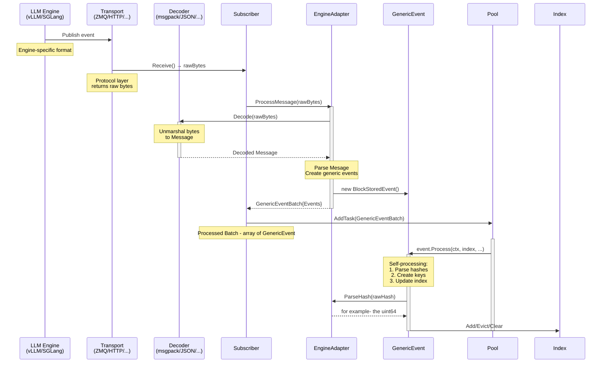

# KV-cache abstrction! :D
---
## Questions
- **KVEventPublisher:** Are vllm and SGlang provide configurable "eventPblisher"? How to use it?
    
    *Maybe we should just use this for the abstraction- NO! We still should abstract, this would be a nice road for implementing different publishers in the future*

    **Answer:** 
    - Vllm: I found it in the code ([register_publisher](https://github.com/vllm-project/vllm/blob/71832ba71e77c01a1d249e014384522b46813749/vllm/distributed/kv_events.py#L480)), but I couldn't find it in any documentation. Maybe it will be a configurable feature in the future (or just other publisher options).

    [link to code snippet](https://github.com/vllm-project/vllm/blob/71832ba71e77c01a1d249e014384522b46813749/examples/online_serving/disaggregated_serving/kv_events.sh#L44)
    ```
     '{"enable_kv_cache_events": true, "publisher": "zmq", "topic": "kv-events"}'
    ```
    - SGlang: Same.
    [link to code snippet](https://github.com/sgl-project/sglang/blob/8916b9d080acec83c23f1d3c8f5d74d1738ebc8f/test/manual/test_kv_events.py#L44)
    ```
    '{"publisher": "zmq", "topic": "kv-events"}',
   ```

- **Hash** Validate if the Hash is calculated the same for both SGlang and vllm.

    Until I do so, we can just assume that they are not (which is 99% the case), and would not mix different engines in the same pool/index.

---
## Current state

### Code View
```
pkg/kvevents/
├── pool.go                    # Pool with vLLM-specific processing
│   └── Pool struct
│
├── events.go                  # vLLM event definitions
│   ├── EventBatch struct      # msgpack array format
│   └── Event struct           
│       ├── BlockStored            # vLLM event struct
│       ├── BlockRemoved           # vLLM event struct
│       └── AllBlocksCleared       # vLLM event struct
│
├── zmq_subscriber.go          # ZMQ-specific subscriber
│   └── zmqSubscriber struct
│
└── subscriber_manager.go      # Manages zmqSubscribers
    └── SubscriberManager
```

### Object diagram


### Data Flow


### Problmes:
- The use of ZMQ and msgpack is tightly integrated within Events and Subscriber structures.
- The pool handles "events" logic. This logic should be separated from the pool, Events should be able to "digest" themselves.


---
## New Architecture - Engine Adapter + Transport + Decode Interfaces

The goal is to seperate the processing logic into a deticated units (objects/structures):
- **Transport:** The dependency on a specific transport protocol (ZMQ, HTTP, etc.) will be encapsulated within 'Transport' interface.
- **Decode:** The dependency on a specific event serilazation (msgpack, JSON, etc.) will be encapsulated within 'Decoder' interface.
- **Message Struct:** The dependency on a specific event struct based on LLM engine (vLLM, SGLang, etc.) will be encapsulated within 'EngineAdapter' interface.

### Simplified Overvirew
A simplified overview of the new components, just to get the feeling (This is just an example, I know that SGLang does use HTTP and JSON).
The relationship is:

```
Subscriber {
    EngineAdapter {
       Transport
        Decoder 
    }
}
```



***Note: Theoretically this scenario is possible but for now it is better to separate different engines with different pools (so, SubscriberManager). This is just to emphasize the flexibility with this design***

For now, it will look something like this:


### Object Diagram

A full object diagram of the design.



### Data Flow



### Architecture Layers Summary

```
┌─────────────────────────────────────────────────────────┐
│    Transport                                            │
│    - ZMQ, HTTP, etc.                                    │
│    - Returns raw bytes                                  │
└─────────────────────────────────────────────────────────┘
                         ↓ raw bytes
┌─────────────────────────────────────────────────────────┐
│    Decoder                                              │
│    - msgpack, JSON, etc.                                │
│    - Unmarshals bytes to structs: Decode()              │
└─────────────────────────────────────────────────────────┘
                         ↓ decoded structs
┌─────────────────────────────────────────────────────────┐
│    Adapter (Translation to GenericEvent)                │
│    - Contains Transport + Decoder                       │
│    - Uses transport to recieve bytes.                   │
│    - Uses Decoder to creates generic events             │
└─────────────────────────────────────────────────────────┘
                         ↓ GenericEventBatch
┌─────────────────────────────────────────────────────────┐
│    Event                                                │
│    - BlockStoredEvent, BlockRemovedEvent, etc.          │
│    - Self-processing events: Digest()                   │
└─────────────────────────────────────────────────────────┘
                         ↓ event.Process()
┌─────────────────────────────────────────────────────────┐
│    Pool                                                 │
│    - Calls event.Digest() (no switch statement!)        │
│    - Manages worker queues                              │
└─────────────────────────────────────────────────────────┘
                         ↓ index 
┌─────────────────────────────────────────────────────────┐
│    Index                                                │
│    - Add/Evict/Clear                                    │
└─────────────────────────────────────────────────────────┘

From subsrciber side:
┌─────────────────────────────────────────────────────────────────────┐
│    SubscriberManager                                                │
│    - Creates and manages multiple Subscribers                       │
│    - Passes Pool reference to each Subscriber                       │
└─────────────────────────────────────────────────────────────────────┘
                              ↓ creates
┌─────────────────────────────────────────────────────────────────────┐
│    Subscriber                                                       │
│    - Holds EngineAdapter                                            │
│    - Sends processed events to Pool                                 │
└─────────────────────────────────────────────────────────────────────┘
                              ↓ uses
┌─────────────────────────────────────────────────────────────────────┐
│    EngineAdapter (interface)                                        │
│    - VLLMAdapter / SGLangAdapter                                    │
│    - Contains Transport + Decoder                                   │
│    - ProcessMessage(): bytes → GenericEventBatch                    │
│    - ParseHash(): engine format → uint64                            │
└─────────────────────────────────────────────────────────────────────┘
                    ↓ contains                ↓ contains
        ┌───────────────────────┐   ┌───────────────────────┐
        │     Transport Layer   │   │     Decoder Layer     │
        │ - ZMQ / HTTP          │   │ - msgpack / JSON      │
        │ - Connect/Bind        │   │ - Unmarshal bytes     │
        │ - Receive bytes       │   │                       │
        └───────────────────────┘   └───────────────────────┘
                              ↓ EngineAdapter returns GenericEventBatch
┌─────────────────────────────────────────────────────────────────────┐
│    GenericEvent (interface)                                         │
│    - BlockStoredEvent / BlockRemovedEvent / AllBlocksClearedEvent   │
│    - Self-processing: event.Process()                               │
│    - Each event knows how to update Index                           │
└─────────────────────────────────────────────────────────────────────┘
                              ↓ event.Process()
┌─────────────────────────────────────────────────────────────────────┐
│    Pool                                                             │
│    - Receives GenericEventBatch from Subscribers                    │
│    - Calls event.Process() for each event                           │
│    - no switch statements!                                          │
└─────────────────────────────────────────────────────────────────────┘
                              ↓ index operations
┌─────────────────────────────────────────────────────────────────────┐
│    Index                                                            │
└─────────────────────────────────────────────────────────────────────┘

```
### Code View

```
pkg/kvevents/
├── transport/
│   ├── transport.go        # Transport interface
│   ├──── zmq.go              # ZMQ implementation
│   └──── http.go             # EXAMPLE: HTTP implementation
│
├── decoder/
│   ├── decoder.go          # Decoder interface
│   ├──── msgpack.go          # Msgpack implementation
│   └──── json.go             # EXAMPLE: JSON implementation
│
├── adapter/
│   ├── adapter.go          # EngineAdapter interface. contains: Transport, Decoder
│   ├──── vllm.go             # VLLMAdapter
│   └──── sglang.go           # EXAMPLE: SGLangAdapter
│
├── events.go                  
│   ├── Event                 # GenericEvent interface
│   └── EventBatch            # GenericEventBatch
│       ├── BlockStored            
│       ├── BlockRemoved           
│       └── AllBlocksCleared       
│
├── pool.go                 # Pool implementation
├── subscriber.go           # Subscriber implementation
└── subscriber_manager.go   # SubscriberManager
```
---

##  Notes
- Should verify that the "self processing events" is a managebale feature. From looking at the pool digestEvent methods looks like it should not be a porblem as long as we handle the "getHash" func.
- Maybe we don't need the "Message" struct, EventBatch can contain more data besides an array of Events.
- Look what is the specific structure of the SGLang events and summerize here. (overall, looks similar, just the actual Event objects have differend fields)
- Go over the flow of creating the subsribers.
- Bind/Connect remains subscriber's responsibility. Trsnaport will just need to implement both options.

